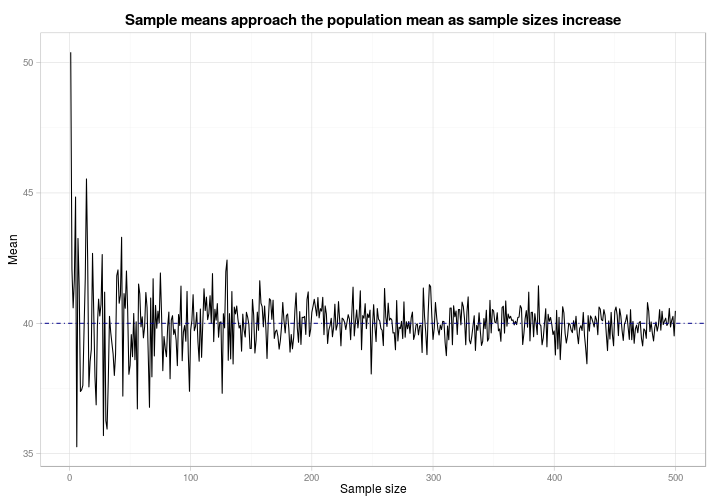

The Law of large numbers
========================================================
author: Rudy
date: April 25, 2015

The Law of Large Numbers
========================================================

The **Law of Large Numbers** app is an interactive [Shiny](http://shiny.rstudio.com)
that let's you examine how the law of large numbers 
allows you to use **samples means** to estimate 
**population means**!


Visualising the distribution and samples
========================================================

The app draws samples from a normal distribution, and demonstrates
how the sample means grow closer to the true population mean with greater
sample sizes.


 

An Example!
========================================================

Let's draw two samples, one of size 5, the other of size 100, from
a normal distribution with $\mu = 40$ and $\sigma = 10$:


```r
mu = 40; sigma = 10
means <- data.frame(
    n = c(5, 100),
    mean = mean(rnorm(c(5, 100), mu, sigma))
)
```


|   n|     mean|
|---:|--------:|
|   5| 49.68266|
| 100| 49.68266|

Use the app now!
========================================================


You can find the app at


